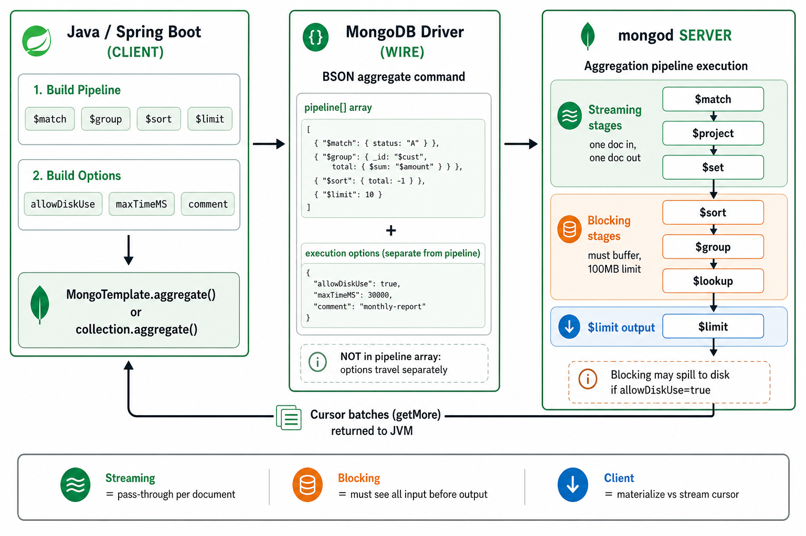
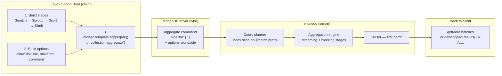
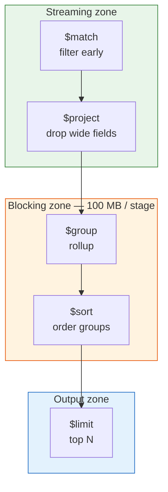

# MongoDB Aggregation & Common Operations — Technical Guide

A practical reference for engineers using **mongosh** and **Spring Boot (Spring Data MongoDB)**. Covers how a pipeline is built, where it runs, streaming vs blocking stages, execution options, and the Java API equivalents.

**Companion demos in this repo:**

| Topic | Demo |
|-------|------|
| JVM materialization vs streaming | `./demo.sh oom` / `./demo.sh good` → [JVM-OOM-TECHNICAL-REFERENCE.md](JVM-OOM-TECHNICAL-REFERENCE.md) |
| `withOptions()` immutability trap | `./demo.sh options` → [AGGREGATION-OPTIONS-TECHNICAL-REFERENCE.md](AGGREGATION-OPTIONS-TECHNICAL-REFERENCE.md) |

---

## Table of contents

1. [Aggregation pipeline flow (overview)](#1-aggregation-pipeline-flow-overview)
2. [Two layers: stages vs execution options](#2-two-layers-stages-vs-execution-options)
3. [Where work runs — client vs server](#3-where-work-runs--client-vs-server)
4. [Streaming, blocking, and non-blocking stages](#4-streaming-blocking-and-non-blocking-stages)
5. [Common aggregation stages — mongosh + Spring Boot](#5-common-aggregation-stages--mongosh--spring-boot)
6. [Execution options — mongosh + Spring Boot](#6-execution-options--mongosh--spring-boot)
7. [Client-side patterns — materialize vs stream](#7-client-side-patterns--materialize-vs-stream)
8. [Other common MongoDB operations (non-aggregation)](#8-other-common-mongodb-operations-non-aggregation)
9. [Production checklist](#9-production-checklist)

---

## 1. Aggregation pipeline flow (overview)



### Mental model in one sentence

You **build** a pipeline description in the JVM, **send** it to MongoDB, the **server executes** every stage, and the driver **streams** result documents back in batches — unless your Java code loads everything into a `List`.

### End-to-end flow



| Step | Where | What happens |
|------|-------|--------------|
| 1 | **JVM** | You compose stage objects (`Aggregation.match`, `Aggregation.group`, …) |
| 2 | **JVM** | You attach execution options via `.withOptions(...)` |
| 3 | **Driver** | Serializes pipeline + options into BSON `aggregate` command |
| 4 | **mongod** | Planner optimizes leading `$match`/`$sort`/`$limit`; engine runs rest |
| 5 | **mongod** | Returns cursor + first batch of result documents |
| 6 | **JVM** | You **stream** (iterator) or **materialize** (`getMappedResults()`) |

> **Key insight:** `$group`, `$sort`, and `$lookup` run on the **database server**, not in Java. The JVM only orchestrates and holds results.

---

## 2. Two layers: stages vs execution options

These are **different things**. Mixing them up causes production bugs.

```
┌─────────────────────────────────────────────────────────────┐
│  AGGREGATE COMMAND                                          │
│                                                             │
│  pipeline: [          ← STAGES (what to compute)            │
│    { "$match": { ... } },                                   │
│    { "$group": { ... } },                                   │
│    { "$sort": { ... } },                                    │
│    { "$limit": 10 }                                         │
│  ]                                                          │
│                                                             │
│  allowDiskUse: true   ← OPTIONS (how to run)                │
│  maxTimeMS: 30000                                           │
│  comment: "analytics/v1"                                    │
└─────────────────────────────────────────────────────────────┘
```

| Layer | Purpose | In `toPipeline()`? | In Spring `Aggregation`? |
|-------|---------|-------------------|--------------------------|
| **Stages** | Transform data (`$match`, `$group`, …) | Yes — stage BSON only | `Aggregation.newAggregation(...)` |
| **Options** | Control execution (`allowDiskUse`, `maxTime`, `comment`) | **No** | `.withOptions(AggregationOptions.builder()...)` |

### Spring — correct assembly

```java
Aggregation pipeline = Aggregation.newAggregation(
        Aggregation.match(Criteria.where("orgId").is(orgId).and("status").is("READY")),
        Aggregation.group("region").count().as("count"),
        Aggregation.sort(Sort.Direction.DESC, "count"),
        Aggregation.limit(10)
).withOptions(AggregationOptions.builder()
        .allowDiskUse(true)
        .maxTime(Duration.ofSeconds(30))
        .comment("demo/invoice-analytics/v1")
        .build());

mongoTemplate.aggregate(pipeline, "invoices", Document.class);
```

### mongosh — equivalent

```javascript
db.invoices.aggregate(
  [
    { $match: { orgId: "org-alpha", status: "READY" } },
    { $group: { _id: "$region", count: { $sum: 1 } } },
    { $sort: { count: -1 } },
    { $limit: 10 }
  ],
  {
    allowDiskUse: true,
    maxTimeMS: 30000,
    comment: "demo/invoice-analytics/v1"
  }
);
```

### Common mistake — `withOptions()` discarded

```java
// WRONG — Spring Aggregation is immutable; this is a no-op
pipeline.withOptions(options);

// RIGHT
pipeline = pipeline.withOptions(options);
// or chain: Aggregation.newAggregation(ops).withOptions(options);
```

See `./demo.sh options` for live broken vs fixed output.

---

## 3. Where work runs — client vs server

| Operation | Runs on | Notes |
|-----------|---------|-------|
| `$match`, `$group`, `$sort`, `$lookup`, `$project` | **mongod** | Server CPU + RAM (+ disk if blocking spills) |
| Index scan / collection scan | **mongod** + WiredTiger | Documents read from cache or disk |
| BSON encode/decode over network | **Driver** | Per batch |
| `getMappedResults()` / `.into(list)` | **JVM** | Decodes **all** documents into Java objects on heap |
| Cursor `iterator()` loop | **JVM** | Holds ~one batch at a time (if you don't accumulate) |
| `toPipeline()` | **JVM** | Extracts stage BSON only — **does not execute** anything |

```
SERVER does the work          CLIENT holds the results
────────────────────          ─────────────────────────
$match  ─┐
$group   ├─ on mongod         getMappedResults()  →  List<Document>  (ALL in heap)
$sort   ─┘                    iterator()          →  one doc at a time
```

---

## 4. Streaming, blocking, and non-blocking stages

### Definitions

| Type | Also called | Behavior | Server memory |
|------|-------------|----------|---------------|
| **Streaming** | Non-blocking, pass-through | Processes documents one-at-a-time (pull model). Downstream can stop upstream early (`$limit`). | O(1) per doc in flight |
| **Blocking** | Synchronization barrier | Must read **all** input before emitting **any** output. | Up to **100 MB per stage** (then spill or fail) |
| **Non-blocking** | Same as streaming | Industry term for stages that don't buffer the full input set | — |

> MongoDB docs use **blocking** for stages like `$sort` and `$group`. Everything else in day-to-day pipelines is effectively **streaming**.

### Visual — document flow

```
INPUT DOCS:  doc1  doc2  doc3  doc4  doc5  ...

STREAMING ($match, $project, $set):
  doc1 ──► out1
  doc2 ──► (filtered)
  doc3 ──► out3
  ...     one in, zero or one out

BLOCKING ($group, $sort):
  doc1 ──┐
  doc2 ──┼──► [ buffer ALL input ] ──► emit results
  doc3 ──┤
  doc4 ──┘

  Time to first result ≈ time to process entire upstream input
```

### Stage classification

| Stage | Type | Why |
|-------|------|-----|
| `$match` | Streaming | Filter per document; index-backed prefix can short-circuit |
| `$project` / `$set` / `$addFields` | Streaming | Shape one doc → one doc |
| `$unset` | Streaming | Drop fields per doc |
| `$unwind` | Streaming | One doc → many docs (array expansion) |
| `$replaceRoot` / `$replaceWith` | Streaming | Reshape per doc |
| `$limit` | Streaming | Stops upstream early once N docs delivered |
| `$skip` | Streaming* | *Still walks and discards N docs — O(n) cost |
| `$sort` | **Blocking** | Must see all docs to determine global order |
| `$group` | **Blocking** | Must see all docs to form groups |
| `$lookup` | **Semi-blocking** | Outer stream is per-parent; subpipeline runs per parent (or once if uncorrelated) |
| `$bucket` / `$bucketAuto` | **Blocking** | Needs full distribution |
| `$facet` | **Blocking** | Runs multiple sub-pipelines on same input |
| `$count` | **Blocking** | Must count all matching docs |
| `$out` / `$merge` | **Blocking** | Writes final result set |

### Blocking stage limits

| Limit | Value | What happens |
|-------|-------|--------------|
| RAM per blocking stage | **100 MB** default | Exceed → error **or** spill to disk |
| `allowDiskUse: true` | Server option | Permits spill to `_tmp` in `dbPath` |
| MongoDB 6.0+ | `allowDiskUseByDefault: true` | Server often allows spill regardless of client flag |
| Per-document size | **16 MB** | Hard limit — includes intermediate docs after `$group` |

Check spill in explain:

```javascript
db.invoices.explain("executionStats").aggregate(pipeline);
// Look for usedDisk: true on $sort / $group stages
```

### Example pipeline — mark the barriers

```
$match   { status: "READY" }     ← streaming (index scan)
$group   { _id: "$region" }      ← BLOCKING (must see all matched docs)
$sort    { count: -1 }           ← BLOCKING (must see all groups)
$limit   10                      ← streaming (stops after 10)
```

Spring equivalent: `InvoiceAnalyticsPipeline.topRegionsByReadyCount()` in this repo.

---

## 5. Common aggregation stages — mongosh + Spring Boot

### Quick reference table

| Stage | Purpose | mongosh | Spring Data MongoDB |
|-------|---------|---------|----------------------|
| `$match` | Filter documents (like `WHERE`) | `{ $match: { status: "READY" } }` | `Aggregation.match(Criteria.where("status").is("READY"))` |
| `$project` | Include/exclude/compute fields | `{ $project: { _id: 0, region: 1 } }` | `Aggregation.project("region")` or `Aggregation.project().and("region").as("region")` |
| `$set` / `$addFields` | Add or overwrite fields | `{ $set: { flagged: true } }` | Custom stage or `Aggregation.addFields().addField("flagged").withValue(true)` |
| `$unset` | Remove fields | `{ $unset: ["metadata"] }` | `Aggregation.unset("metadata")` |
| `$group` | Aggregate by key | `{ $group: { _id: "$region", count: { $sum: 1 } } }` | `Aggregation.group("region").count().as("count")` |
| `$sort` | Order results | `{ $sort: { count: -1 } }` | `Aggregation.sort(Sort.Direction.DESC, "count")` |
| `$limit` | Cap output | `{ $limit: 10 }` | `Aggregation.limit(10)` |
| `$skip` | Offset pagination | `{ $skip: 100 }` | `Aggregation.skip(100)` |
| `$unwind` | Flatten array | `{ $unwind: "$lineItems" }` | `Aggregation.unwind("lineItems")` |
| `$lookup` | Join another collection | `{ $lookup: { from: "...", localField, foreignField, as } }` | `LookupOperation.newLookup().from(...).localField(...)...` |
| `$count` | Count documents | `{ $count: "total" }` | `Aggregation.count().as("total")` |
| `$facet` | Multiple sub-pipelines | `{ $facet: { byRegion: [...], totals: [...] } }` | `FacetOperation` / custom `Document` stage |
| `$merge` | Write to collection | `{ $merge: { into: "rollup" } }` | `MergeOperation` |
| `$out` | Replace collection | `{ $out: "archive" }` | `OutOperation` |

### Worked example — top regions by READY invoice count

**mongosh:**

```javascript
db.invoices.aggregate([
  { $match: { orgId: "org-alpha", status: "READY" } },
  { $group: { _id: "$region", count: { $sum: 1 } } },
  { $sort: { count: -1 } },
  { $limit: 10 }
]);
```

**Spring Boot:**

```java
var match = Aggregation.match(
        Criteria.where("orgId").is("org-alpha").and("status").is("READY"));
var group = Aggregation.group("region").count().as("count");
var sort  = Aggregation.sort(Sort.Direction.DESC, "count");
var limit = Aggregation.limit(10);

Aggregation pipeline = Aggregation.newAggregation(match, group, sort, limit);
List<Document> results = mongoTemplate
        .aggregate(pipeline, "invoices", Document.class)
        .getMappedResults();
```

**Repo reference:** `InvoiceAnalyticsPipeline.java`, `AggregationOptionsController.java`

### `$group` accumulators

| Accumulator | mongosh | Spring |
|-------------|---------|--------|
| Count | `{ $sum: 1 }` | `.count().as("count")` |
| Sum | `{ $sum: "$amount" }` | `.sum("amount").as("total")` |
| Avg | `{ $avg: "$amount" }` | `.avg("amount").as("avgAmount")` |
| Min / Max | `{ $min: "$amount" }` | `.min("amount").as("minAmount")` |
| Push array | `{ $push: "$$ROOT" }` | `.push("doc").as("docs")` |
| Add to set | `{ $addToSet: "$sku" }` | `.addToSet("sku").as("skus")` |

### `$lookup` — join pattern

**mongosh (equality join):**

```javascript
db.orders.aggregate([
  { $match: { _id: "ord-001" } },
  { $lookup: {
      from: "order_lines",
      localField: "_id",
      foreignField: "orderId",
      as: "lines"
  }}
]);
```

**Spring:**

```java
LookupOperation lookup = LookupOperation.newLookup()
        .from("order_lines")
        .localField("_id")
        .foreignField("orderId")
        .as("lines");

Aggregation pipeline = Aggregation.newAggregation(
        Aggregation.match(Criteria.where("_id").is("ord-001")),
        lookup
);
```

> Prefer `$filter` / `$map` on embedded arrays over `$lookup` → `$unwind` → `$group` when data is already embedded.

---

## 6. Execution options — mongosh + Spring Boot

| Option | Purpose | mongosh | Spring Boot |
|--------|---------|---------|-------------|
| `allowDiskUse` | Let blocking stages spill past 100 MB | `{ allowDiskUse: true }` | `.allowDiskUse(true)` in `AggregationOptions` |
| `maxTimeMS` / `maxTime` | Server-side timeout | `{ maxTimeMS: 30000 }` | `.maxTime(Duration.ofSeconds(30))` |
| `comment` | Traceability in `currentOp` / profiler | `{ comment: "analytics/v1" }` | `.comment("analytics/v1")` |
| `hint` | Force index | `{ hint: { orgId: 1, status: 1 } }` | `.hint(new Document("orgId", 1).append("status", 1))` |
| `batchSize` | Cursor batch size (client pull) | `{ cursor: { batchSize: 500 } }` | `.cursorBatchSize(500)` in options, or `.batchSize(500)` on driver iterable |
| `collation` | String comparison rules | `{ collation: { locale: "en" } }` | `.collation(Collation.of("en"))` |
| `readPreference` | Which replica to read | `{ readPreference: "secondaryPreferred" }` | `@ReadPreference` or template read preference |

### Spring — full options example

```java
AggregationOptions options = AggregationOptions.builder()
        .allowDiskUse(true)
        .maxTime(Duration.ofSeconds(30))
        .comment("invoices/top-regions/v1")
        .cursorBatchSize(500)
        .build();

Aggregation pipeline = Aggregation.newAggregation(match, group, sort, limit)
        .withOptions(options);

mongoTemplate.aggregate(pipeline, "invoices", Document.class);
```

### Raw Java driver — options on `AggregateIterable`

When using `toPipeline()`, set options on the driver — not only on Spring object:

```java
collection.aggregate(pipeline.toPipeline(Aggregation.DEFAULT_CONTEXT))
        .allowDiskUse(true)
        .maxTime(30, TimeUnit.SECONDS)
        .comment("invoices/top-regions/v1")
        .batchSize(500)
        .iterator();
```

---

## 7. Client-side patterns — materialize vs stream

The server always streams results to the driver. **What you do in Java** determines heap usage.

| Pattern | Java API | Heap growth | When to use |
|---------|----------|-------------|-------------|
| **Materialize** | `getMappedResults()`, `.into(list)` | O(result size) | Small, bounded result sets |
| **Stream** | `iterator()`, cursor loop | O(batch size) | Large exports, ETL, reports |
| **Reactive** | `ReactiveMongoTemplate.aggregate().subscribe()` | Backpressure-controlled | WebFlux, high concurrency |

### Materialize — anti-pattern at scale

```java
// BAD for large N — entire result set on JVM heap
AggregationResults<Document> results = mongoTemplate.aggregate(pipeline, "invoices", Document.class);
List<Document> all = results.getMappedResults();
```

**Demo:** `GET /bad` → `./demo.sh oom`

### Stream — correct for large results

```java
// GOOD — process one batch at a time
Aggregation pipeline = readyInvoicesPipeline(limit);
try (var cursor = mongoTemplate.getCollection("invoices")
        .aggregate(pipeline.toPipeline(Aggregation.DEFAULT_CONTEXT))
        .batchSize(500)
        .iterator()) {
    while (cursor.hasNext()) {
        Document doc = cursor.next();
        // process doc, then discard
    }
}
```

**Demo:** `GET /good` → `./demo.sh good`

### How server streaming relates to client materialization

```
mongod                         driver                    JVM
──────                         ──────                    ───
$match → $limit  ──batch──►   decode BSON  ──►  getMappedResults() → List (ALL)
              ──batch──►   decode BSON  ──►  iterator().next()   → one doc
```

Even a streaming server pipeline (`$match` + `$limit`) causes OOM if the client calls `getMappedResults()` on millions of rows.

---

## 8. Other common MongoDB operations (non-aggregation)

For completeness — operations you use alongside aggregations.

### Read (find)

| Operation | mongosh | Spring Boot |
|-----------|---------|-------------|
| Find one | `db.invoices.findOne({ status: "READY" })` | `mongoTemplate.findOne(Query.query(Criteria.where("status").is("READY")), Invoice.class)` |
| Find many | `db.invoices.find({ status: "READY" }).limit(100)` | `mongoTemplate.find(query, Invoice.class)` |
| Count | `db.invoices.countDocuments({ status: "READY" })` | `mongoTemplate.count(query, Invoice.class)` |
| Distinct | `db.invoices.distinct("region", { status: "READY" })` | `mongoTemplate.findDistinct(query, "region", Invoice.class, String.class)` |

### Write

| Operation | mongosh | Spring Boot |
|-----------|---------|-------------|
| Insert one | `db.invoices.insertOne({ ... })` | `mongoTemplate.insert(doc)` or `repository.save(entity)` |
| Insert many | `db.invoices.insertMany([...])` | `mongoTemplate.insertAll(list)` |
| Update one | `db.invoices.updateOne({ _id }, { $set: { status: "EXPORTED" } })` | `mongoTemplate.updateFirst(query, Update.update("status", "EXPORTED"), Invoice.class)` |
| Update many | `db.invoices.updateMany(filter, { $set: ... })` | `mongoTemplate.updateMulti(query, update, Invoice.class)` |
| Upsert | `updateOne(filter, update, { upsert: true })` | `Update.set(...)` + `mongoTemplate.upsert(query, update, Invoice.class)` |
| Delete | `db.invoices.deleteMany({ status: "PENDING" })` | `mongoTemplate.remove(query, Invoice.class)` |

### Index

| Operation | mongosh | Spring Boot |
|-----------|---------|-------------|
| Create index | `db.invoices.createIndex({ orgId: 1, status: 1 })` | `@Indexed` / `@CompoundIndex` on entity, or `IndexOperations` |
| List indexes | `db.invoices.getIndexes()` | `mongoTemplate.indexOps(Invoice.class).getIndexInfo()` |
| Explain find | `db.invoices.find(q).explain("executionStats")` | `mongoTemplate.execute(Invoice.class, coll -> coll.find(q).explain())` |
| Explain aggregation | `db.invoices.explain("executionStats").aggregate(pipeline)` | `mongoTemplate.execute(Invoice.class, coll -> coll.aggregate(pipeline).explain())` |

### When to use find vs aggregation

| Use **find** | Use **aggregation** |
|--------------|---------------------|
| Simple filter + projection | `$group`, `$lookup`, multi-stage transforms |
| Single-document lookup by `_id` | Rollups, analytics, reports |
| Pagination with stable sort on indexed field | Complex joins across collections |
| Covered query (projection from index only) | Reshape + compute in one round-trip |

---

## 9. Production checklist

### Pipeline design

- [ ] `$match` as early as possible — filter before `$group` / `$lookup`
- [ ] Compound index supports leading `$match` (+ `$sort` if present) — ESR rule
- [ ] Avoid `$skip` for large exports — use seek pagination (`_id > lastSeen`)
- [ ] Drop wide fields with `$project` / `$unset` **before** blocking stages
- [ ] `$limit` / `$topN` after `$sort` for top-K — don't sort millions to take 10

### Execution options

- [ ] `withOptions()` result **chained or assigned** (not discarded)
- [ ] `comment` set on every HTTP-facing analytics path
- [ ] `maxTime` set so runaway queries release threads
- [ ] `allowDiskUse` only when explain shows `usedDisk: true`
- [ ] Raw driver path: options on `AggregateIterable`, not only Spring object

### Client (JVM)

- [ ] Large result sets: **stream** cursor, never `getMappedResults()` on unbounded data
- [ ] Set `batchSize` on cursor for predictable memory
- [ ] Close cursor (`try-with-resources`) to release connection back to pool

### Observability

```javascript
// Find slow aggregations by comment (admin DB)
use admin
db.aggregate([
  { $currentOp: { allUsers: true } },
  { $match: { "command.comment": /invoice-analytics/ } }
])
```

---

## Quick diagram — stage types in a typical analytics pipeline



---

## File index (this repo)

| File | Content |
|------|---------|
| `docs/aggregation-pipeline-flow.png` | Pipeline flow diagram (this doc) |
| `InvoiceController.java` | Materialize vs stream demo |
| `InvoiceAnalyticsPipeline.java` | Shared aggregation pipeline |
| `AggregationOptionsController.java` | Options trap demos |
| `scripts/seed-invoices.mongosh.js` | Test data |
| `scripts/aggregation-options.mongosh.js` | Console options reference (manual) |
