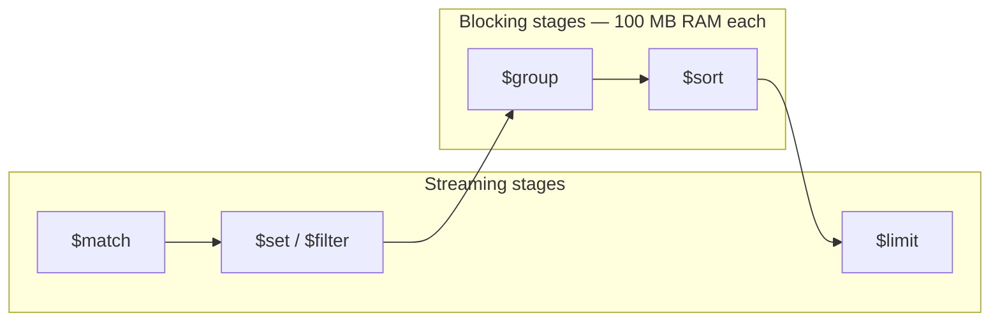

# Pipeline Performance — Technical Guide

How to order aggregation stages, avoid expensive array patterns, and push `$match` early — with **exact pipelines** from `scripts/pipeline-performance.mongosh.js` on the demo **`invoices`** collection.

---

## Run the demos

```bash
./start.sh
mongosh mongodb://localhost:27018/mongo_demo --file scripts/pipeline-performance.mongosh.js
```

| Environment variable | Default | Purpose |
|---------------------|---------|---------|
| `INVOICE_ID` | `INV-00000042` | Single-invoice array examples (TIP 2) |
| `ORG_ID` | `org-alpha` | Partition for org-wide examples |
| `RUN_EXPLAIN=1` | off | Print explain stats for optimal pipelines |

```bash
RUN_EXPLAIN=1 INVOICE_ID=INV-00000100 mongosh mongodb://localhost:27018/mongo_demo \
  --file scripts/pipeline-performance.mongosh.js
```

Validate any change with explain — tune only after the pipeline is **functionally correct**:

```javascript
db.invoices.explain("executionStats").aggregate(pipeline);
```

---

## Demo data context

Collection: `invoices` in `mongo_demo` (~100k documents after `./setup.sh`).

Relevant fields:

| Field | Type | Notes |
|-------|------|-------|
| `orgId` | string | `org-alpha`, `org-beta`, … — partition key |
| `status` | string | `READY`, `PENDING`, `EXPORTED` |
| `amount` | NumberDecimal | Invoice total |
| `region` | string | `EU`, `US`, `APAC`, `LATAM` |
| `reportingPeriod` | string | e.g. `"2024-03"` |
| `lineItems` | array | 4–10 items with `unitPrice`, `quantity`, `sku` |
| `metadata`, `supplier` | object | Wide fields — drop before `$group` |

Indexes seeded: `{ status: 1 }`, `{ orgId: 1, reportingPeriod: 1 }`.

---

## Streaming vs blocking (background)



| Type | Stages | Behaviour |
|------|--------|-----------|
| **Streaming** | `$match`, `$set`, `$filter`, `$project`, `$limit` | Batch in → batch out; `$limit` can stop upstream early |
| **Blocking** | `$sort`, `$group`, `$bucket`, `$facet`, `$count` | Must accumulate **all** input before emitting |

**Why `$sort` blocks:** sorting batch-by-batch does not produce a globally sorted result.  
**Why `$group` blocks:** grouping batch-by-batch duplicates `_id` values across batches.

Blocking stages hit a **100 MB RAM cap** per stage (spill to disk with `allowDiskUse`, or error).

---

## TIP 1 — Stage ordering: `$match` early, `$sort` + `$limit` for top-K

**Principle:** Shrink the working set **before** any blocking stage. Use `$sort` + `$limit` together for top-K (internal heap sort, O(limit) memory).

### 1a. BAD — `$sort` before `$match`

**Problem:** `$sort` runs on the full collection (or a huge subset) before filtering. At scale this is orders of magnitude slower and may spill to disk.

```javascript
// Anti-pattern: sort everything, then filter
const badSortOrder = [
  { $sort: { amount: -1 } },
  { $match: { orgId: "org-alpha", status: "READY" } },
  { $limit: 5 },
  { $project: { _id: 0, invoiceId: 1, amount: 1, region: 1 } },
];

db.invoices.aggregate(badSortOrder);
```

```
ALL invoices  →  $sort (BLOCKING on ~100k)  →  $match  →  $limit 5
                 ▲ expensive
```

### 1b. GOOD — `$match` → `$sort` → `$limit`

**Fix:** Filter first. Only READY invoices for `org-alpha` enter the sort. `$limit: 5` triggers **top-K** optimisation with `$sort`.

```javascript
const goodSortOrder = [
  { $match: { orgId: "org-alpha", status: "READY" } },
  { $sort: { amount: -1 } },
  { $limit: 5 },
  { $project: { _id: 0, invoiceId: 1, amount: 1, region: 1 } },
];

db.invoices.aggregate(goodSortOrder);
```

```
~25k READY docs  →  $sort + $limit (top-5 heap)  →  5 results
```

**Explain check** (`RUN_EXPLAIN=1`):

```javascript
const ex = db.invoices.explain("executionStats").aggregate(goodSortOrder);
// Look for: lower totalDocsExamined, top-K sort plan
```

### 1c. GOOD — `$unset` wide fields before blocking `$group`

**Problem:** `$group` buffers data in memory. Carrying `lineItems` (4–10 sub-docs each) into `$group` wastes RAM.

**Fix:** `$match` → `$unset` heavy fields → `$group` summary → `$sort` (only 4 regions).

```javascript
const groupWithShrink = [
  { $match: { orgId: "org-alpha", status: "READY" } },
  { $unset: [ "lineItems", "metadata", "supplier" ] },
  { $group: {
      _id: "$region",
      invoiceCount: { $sum: 1 },
      totalAmount: { $sum: { $toDouble: "$amount" } },
  }},
  { $sort: { totalAmount: -1 } },
  { $limit: 5 },
];

db.invoices.aggregate(groupWithShrink);
```

| Stage | Documents in flight | Blocking? |
|-------|---------------------|-------------|
| `$match` | ~25k (org-alpha READY) | No |
| `$unset` | ~25k (smaller BSON) | No |
| `$group` | **4 groups** | Yes — but tiny |
| `$sort` | 4 groups | Yes — trivial |

### Spring Boot — TIP 1

```java
// Top-K
Aggregation.newAggregation(
    Aggregation.match(Criteria.where("orgId").is("org-alpha").and("status").is("READY")),
    Aggregation.sort(Sort.Direction.DESC, "amount"),
    Aggregation.limit(5),
    Aggregation.project("invoiceId", "amount", "region").andExclude("_id")
);

// Group with unset (custom $unset stage or fields exclusion before group)
Aggregation.newAggregation(
    Aggregation.match(Criteria.where("orgId").is("org-alpha").and("status").is("READY")),
    Aggregation.unset("lineItems", "metadata", "supplier"),
    Aggregation.group("region")
        .count().as("invoiceCount")
        .sum(ConvertOperators.ToDouble.toDouble("$amount")).as("totalAmount"),
    Aggregation.sort(Sort.Direction.DESC, "totalAmount"),
    Aggregation.limit(5)
);
```

---

## TIP 2 — Array transform: `$filter` beats `$unwind` + `$group`

**Principle:** To change an array **inside each document**, use **array operators** (`$filter`, `$map`, `$sum`). Never `$unwind` → transform → `$group` by `$_id` unless you need a **cross-document** report.

**Goal:** On invoice `INV-00000042`, keep only `lineItems` where `unitPrice > 50`.

### 2a. SUBOPTIMAL — `$unwind` → `$match` → `$group` by `$_id`

**Problem:**

1. One invoice → N rows after `$unwind`
2. `$group` is **blocking** on the inflated stream
3. Must `$first` / `$push` every field to rebuild the document

```javascript
const badArrayTransform = [
  { $match: { invoiceId: "INV-00000042" } },
  { $unwind: "$lineItems" },
  { $match: { "lineItems.unitPrice": { $gt: NumberDecimal("50.00") } } },
  { $group: {
      _id: "$_id",
      invoiceId: { $first: "$invoiceId" },
      orgId: { $first: "$orgId" },
      region: { $first: "$region" },
      status: { $first: "$status" },
      amount: { $first: "$amount" },
      lineItems: { $push: "$lineItems" },
  }},
];

db.invoices.aggregate(badArrayTransform);
```

At **100k invoices** × ~7 line items ≈ **700k rows** through `$group` — fatal for memory and time.

**Recognise this anti-pattern:** `$group` with `_id: "$_id"` immediately after `$unwind`.

### 2b. OPTIMAL — `$filter` on `lineItems` (streaming)

**Fix:** One streaming `$set` stage. No blocking. Works per document in isolation.

```javascript
const goodArrayTransform = [
  { $match: { invoiceId: "INV-00000042" } },
  { $set: {
      lineItems: {
        $filter: {
          input: "$lineItems",
          as: "line",
          cond: { $gt: ["$$line.unitPrice", NumberDecimal("50.00")] },
        },
      },
  }},
];

db.invoices.aggregate(goodArrayTransform);
```

| | Suboptimal | Optimal |
|---|------------|---------|
| Blocking stage | Yes (`$group`) | No |
| Rows at scale | O(docs × array size) | O(docs) |
| Rebuild document | Manual `$first`/`$push` | Not needed |

**Note:** `$filter` keeps invoices whose `lineItems` become empty. To drop them:

```javascript
{ $match: { "lineItems.0": { $exists: true } } }  // after $set
```

### 2c. BONUS — `$sum` with `$map` (no `$unwind`)

**Goal:** Compute `lineTotal` from `quantity × unitPrice` without expanding the array.

```javascript
db.invoices.aggregate([
  { $match: { invoiceId: "INV-00000042" } },
  { $set: {
      lineItemCount: { $size: "$lineItems" },
      lineTotal: {
        $sum: {
          $map: {
            input: "$lineItems",
            as: "line",
            in: { $multiply: ["$$line.quantity", { $toDouble: "$$line.unitPrice" }] },
          },
        },
      },
  }},
  { $project: { _id: 0, invoiceId: 1, lineItemCount: 1, lineTotal: 1, amount: 1 } },
]);
```

### When `$unwind` + `$group` **is** correct

Cross-document analytics — e.g. **revenue per SKU across all invoices**:

```javascript
[
  { $match: { orgId: "org-alpha" } },
  { $unwind: "$lineItems" },
  { $group: {
      _id: "$lineItems.sku",
      revenue: { $sum: { $multiply: ["$lineItems.quantity", { $toDouble: "$lineItems.unitPrice" }] } },
      orderCount: { $sum: 1 },
  }},
  { $sort: { revenue: -1 } },
  { $limit: 10 },
]
```

Here `$group` groups by **SKU**, not `$_id` — global aggregation, blocking is expected.

### Spring Boot — TIP 2

```java
// $filter via custom stage
Aggregation.stage(context -> new Document("$set", new Document("lineItems",
    new Document("$filter", new Document("input", "$lineItems")
        .append("as", "line")
        .append("cond", new Document("$gt", List.of(
            "$$line.unitPrice", new org.bson.types.Decimal128(new BigDecimal("50.00"))))))));
```

---

## TIP 3 — Push `$match` early: source field vs computed field

**Principle:** MongoDB promotes `$match` to the top when safe. A `$match` on a **computed field** is trapped behind `$set` and cannot use indexes on source fields.

### 3a. SUBOPTIMAL — `$match` on computed `amountDisplay`

**Problem:** Filter runs after every document is transformed. Index on `amount` unused.

```javascript
const badMatch = [
  { $match: { orgId: "org-alpha" } },
  { $set: { amountDisplay: { $toDouble: "$amount" } } },
  { $match: { amountDisplay: { $gte: 500 } } },
  { $limit: 3 },
  { $project: { _id: 0, invoiceId: 1, amount: 1, amountDisplay: 1 } },
];

db.invoices.aggregate(badMatch);
```

```
org-alpha docs  →  $set ALL  →  $match amountDisplay ≥ 500  →  3 results
                     ▲ wasted work on docs that fail the filter
```

### 3b. OPTIMAL — `$match` on source `amount` before `$set`

**Fix:** Filter on `NumberDecimal` `amount` first. Same business outcome for passing documents.

```javascript
const goodMatch = [
  { $match: {
      orgId: "org-alpha",
      amount: { $gte: NumberDecimal("500.00") },
  }},
  { $set: { amountDisplay: { $toDouble: "$amount" } } },
  { $limit: 3 },
  { $project: { _id: 0, invoiceId: 1, amount: 1, amountDisplay: 1 } },
];

db.invoices.aggregate(goodMatch);
```

**Explain check:** filter pushed toward scan; fewer docs through `$set`.

### 3c. PARTIAL MATCH — indexed filter before computed field

**Problem:** You must `$match` on `reportingLabel` (computed from `region` + `reportingPeriod`). Cannot move that match before `$set`.

**Fix:** Add a **wider** `$match` at the top on indexed / source fields to shrink the cursor first.

```javascript
const partialMatch = [
  { $match: {
      orgId: "org-alpha",
      status: "READY",
      reportingPeriod: { $gte: "2024-06" },
  }},
  { $set: {
      reportingLabel: { $concat: ["$region", "-", "$reportingPeriod"] },
  }},
  { $match: { reportingLabel: { $regex: /^EU-2024-/ } } },
  { $limit: 3 },
  { $project: { _id: 0, invoiceId: 1, reportingLabel: 1, amount: 1 } },
];

db.invoices.aggregate(partialMatch);
```

| Stage | Role |
|-------|------|
| First `$match` | Shrinks input using `orgId`, `status`, `reportingPeriod` |
| `$set` | Builds `reportingLabel` on smaller set |
| Second `$match` | Precise filter on computed field |
| `$limit` | Cap output |

A few extra docs may pass the first `$match` but fail the second — final output is correct.

### `$match` after `$group` — different semantics

```javascript
{ $group: { _id: "$region", total: { $sum: { $toDouble: "$amount" } } } },
{ $match: { total: { $gt: 100000 } } }   // filters GROUPS — cannot move before $group
```

Still **`$match` documents before `$group`** when you can:

```javascript
{ $match: { orgId: "org-alpha", status: "READY" } },
{ $group: { _id: "$region", total: { $sum: { $toDouble: "$amount" } } } },
{ $match: { total: { $gt: 100000 } } },
```

### Spring Boot — TIP 3

```java
// Optimal — match on source field
Aggregation.newAggregation(
    Aggregation.match(Criteria.where("orgId").is("org-alpha")
        .and("amount").gte(new BigDecimal("500.00"))),
    Aggregation.addFields().addField("amountDisplay")
        .withValueOf(ConvertOperators.ToDouble.toDouble("$amount")).build(),
    Aggregation.limit(3)
);
```

---

## Pipeline catalogue (script → doc map)

| Script section | Pipeline variable | Doc section |
|----------------|-------------------|-------------|
| TIP 1 BAD | `badSortOrder` | [1a](#1a-bad--sort-before-match) |
| TIP 1 GOOD | `goodSortOrder` | [1b](#1b-good--match--sort--limit) |
| TIP 1 GROUP | `groupWithShrink` | [1c](#1c-good--unset-wide-fields-before-blocking-group) |
| TIP 2 BAD | `badArrayTransform` | [2a](#2a-suboptimal--unwind--match--group-by-_id) |
| TIP 2 GOOD | `goodArrayTransform` | [2b](#2b-optimal--filter-on-lineitems-streaming) |
| TIP 2 BONUS | line total | [2c](#2c-bonus--sum-with-map-no-unwind) |
| TIP 3 BAD | `badMatch` | [3a](#3a-suboptimal--match-on-computed-amountdisplay) |
| TIP 3 GOOD | `goodMatch` | [3b](#3b-optimal--match-on-source-amount-before-set) |
| TIP 3 PARTIAL | `partialMatch` | [3c](#3c-partial-match--indexed-filter-before-computed-field) |

---

## Quick reference

### Recommended stage order

```
1. $match      — partition (orgId), status, indexed fields
2. $unset      — drop lineItems / metadata before $group
3. $set        — $filter, $map, computed fields (streaming)
4. $group      — summaries only ($sum, $count, $avg)
5. $sort       — after input is smallest possible
6. $limit      — immediately after $sort (top-K)
```

### Smell → fix

| Smell | Fix |
|-------|-----|
| `$sort` before `$match` | Move `$match` up |
| `$group` on `$_id` after `$unwind` | Use `$filter` / `$map` |
| `$match` on `$set` output | Match on source field if equivalent |
| `$group` with `$push: "$$ROOT"` | Accumulate summaries only |
| explain: `COLLSCAN`, huge `totalDocsExamined` | Index + early `$match` |

### Explain — what to check

| Field | Good | Bad |
|-------|------|-----|
| `winningPlan.stage` | `IXSCAN` | `COLLSCAN` on large coll |
| `totalDocsExamined` vs `nReturned` | Close | Millions examined, few returned |
| `$sort` / `$group` in explain | `usedDisk: false` | `usedDisk: true` |

---

## Main takeaway

| # | Principle | Demo |
|---|-----------|------|
| 1 | Shrink input **before** blocking `$sort` / `$group` | `goodSortOrder`, `groupWithShrink` |
| 2 | Per-document array work → **`$filter`**, not `$unwind` + `$group` | `goodArrayTransform` |
| 3 | **`$match` on source fields** early; partial `$match` when computed filter required | `goodMatch`, `partialMatch` |

---

## Related files

| File | Purpose |
|------|---------|
| `scripts/pipeline-performance.mongosh.js` | Runnable script for all pipelines above |
| `PIPELINE-PERFORMANCE-GUIDE.md` | This document |
| `SET-UNSET-VS-PROJECT.md` | `$unset` before `$group` (field shaping) |
| `MONGODB-AGGREGATION-OPERATIONS-GUIDE.md` | Streaming vs blocking, Spring API |
| `InvoiceAnalyticsPipeline.java` | Spring top-K + group rollup |
